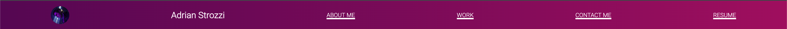
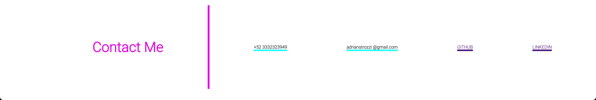
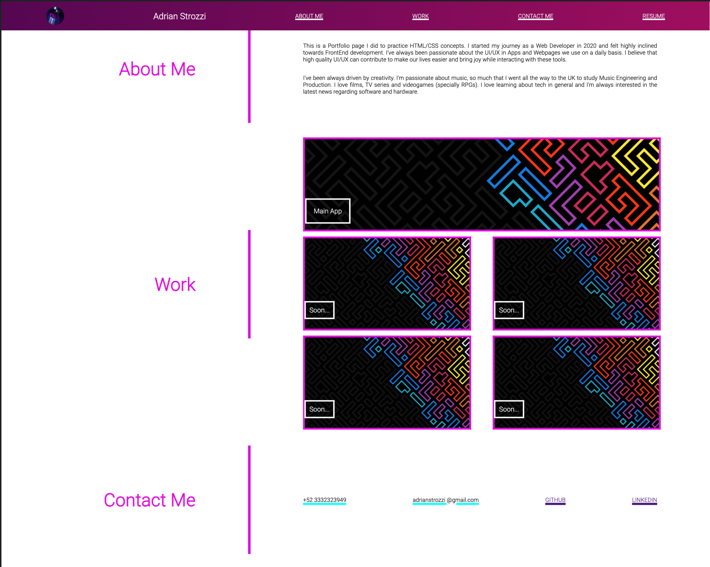

# **Adrian Strozzi - Portfolio**

## Description

> Welcome to my Portfolio page! This a basic page I did to practice HTML and CSS, here I'll be uploading a showcase of my deployed pages and applications.

## How to use

Use this **link** to access my webpage: [Adrian Strozzi-Portfolio](https://adrianstrozzi.github.io/Tec02Portfolio/)

## Usage

Just use the **navigation bar** to access any section of your interest:  

Don't forget to visit the **contact me section** to view my contact information, GitHub and Linkedin links.

Below is an image of our main page:  

## Credits

**Adrian Strozzi:** [https://github.com/adrianstrozzi](https://github.com/adrianstrozzi)

## License

**© 2021 Adrian Strozzi**
